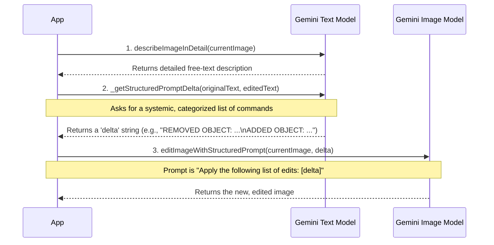
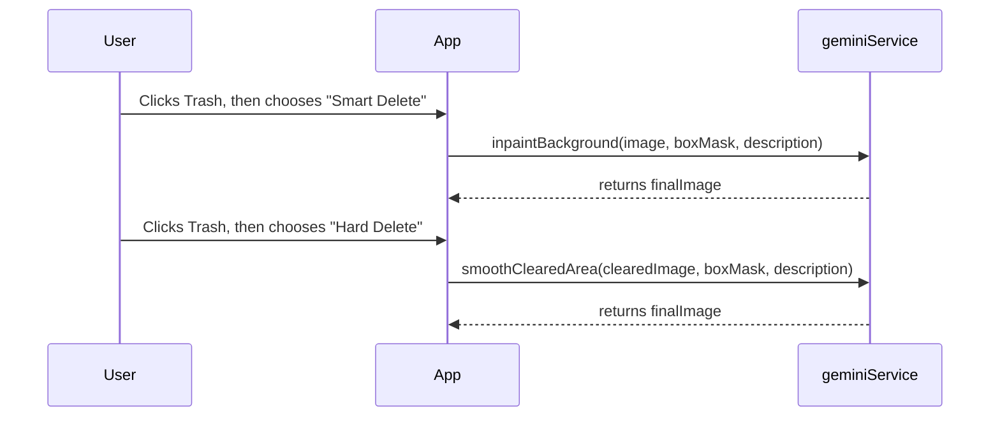
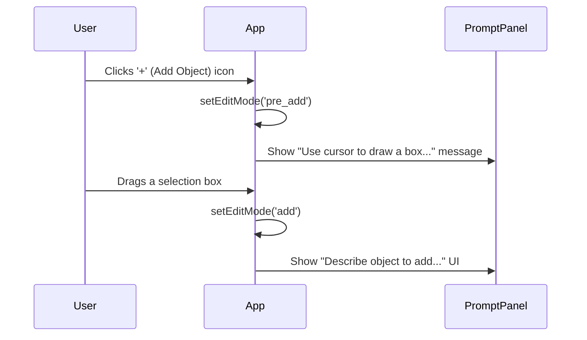
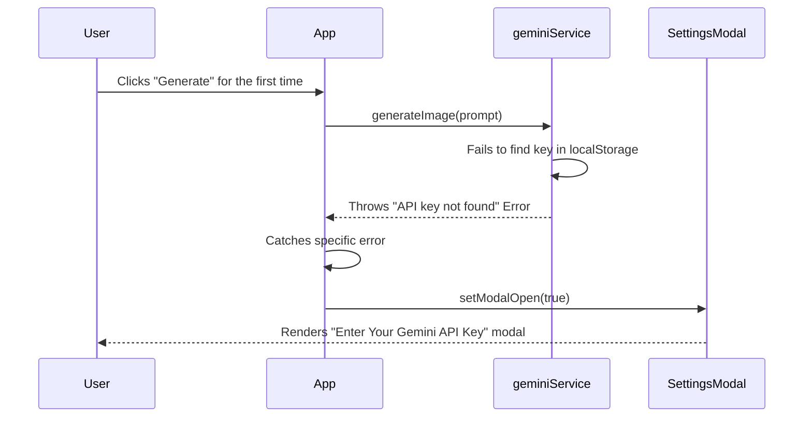

# Engineering Design Document: Banana Peel

**Version:** 1.1
**Date:** 2023-11-19
**Author:** World-Class Senior Frontend Engineer

## 1. Overview

Banana Peel is a web-based, AI-powered image generation and editing tool. It leverages the Google Gemini API to provide a seamless user experience for creating and manipulating images.

**For a complete and detailed breakdown of all user-facing features, user stories, and product goals, please refer to the [Product Requirements Document (PRODUCT.md)](./PRODUCT.md), which serves as the single source of truth for all product-related information.**

## 2. High-Level Architecture

The application follows a modern, component-based frontend architecture using React. State management is centralized within a main `App` component, which orchestrates data flow between UI components and backend services. The architecture is designed to be modular and maintainable, separating concerns between UI, state, and service logic.

### Architectural Diagram

```mermaid
graph TD
    subgraph "User Interface (View)"
        UI_User[User] --> PromptPanel;
        UI_User --> CanvasArea;
        UI_User -- Toggles --> LogViewer;
        LogViewer -- Opens --> ApiInspectorModal;
        UI_User -- Enters key --> SettingsModal;
        UI_User -- Confirms --> ConfirmationModal;
        PromptPanel -- Opens --> ExpandedEditModal;
        
        subgraph "Editing State UI"
            direction TB
            CanvasHeader["Canvas Header<br/>(Undo, Redo, Download)"]
            CanvasArea;
            CanvasHeader --> CanvasArea
        end

        PromptPanel -- Triggers Handlers --> App;
        CanvasArea -- onSelect event --> App;
    end

    subgraph "Application Core (Controller/State)"
        App[App.tsx<br/><i>Central State & Logic</i>];
    end

    subgraph "Services (Model/Logic)"
        GeminiService[geminiService.ts<br/><i>Gemini API Abstraction</i>];
        ImageUtils[imageUtils.ts<br/><i>Image Processing Utilities</i>];
        LoggerService[logger.ts<br/><i>Logging Service</i>];
        ApiKeyStore[apiKeyStore.ts<br/><i>LocalStorage Wrapper</i>];
        ApiHistory[apiCallHistory.ts<br/><i>API 'Flight Recorder'</i>]
        GeminiAPI[Google Gemini API<br/><i>External Service</i>];
    end

    subgraph "Testing"
        TestHarness[TestHarness.tsx];
        TestScript[test-script.ts];
        App -- Provides Handles --> TestHarness;
        TestHarness -- Executes --> TestScript;
    end

    App -- Renders & Controls --> PromptPanel;
    App -- Renders & Controls --> CanvasHeader;
    App -- Renders & Controls --> CanvasArea;
    App -- Renders & Controls --> LogViewer;
    App -- Renders & Controls --> SettingsModal;
    App -- Renders & Controls --> ConfirmationModal;
    App -- Renders & Controls --> ApiInspectorModal;
    App -- Renders & Controls --> ExpandedEditModal;
    App -- Calls --> GeminiService;
    App -- Calls --> ImageUtils;
    App -- Configures --> LoggerService;
    LoggerService -- Pushes Logs --> App;
    ApiHistory -- Pushes History --> App;

    GeminiService -- Records to --> ApiHistory;
    GeminiService -- Reads from --> ApiKeyStore;
    GeminiService -- HTTP Requests --> GeminiAPI;
    SettingsModal -- Saves to --> ApiKeyStore;

    style App fill:#f9f,stroke:#333,stroke-width:2px
    style GeminiService fill:#bbf,stroke:#333,stroke-width:2px
    style ImageUtils fill:#bbf,stroke:#333,stroke-width:2px
    style LoggerService fill:#bbf,stroke:#333,stroke-width:2px
    style ApiHistory fill:#bbf,stroke:#333,stroke-width:2px
```

## 3. Key Services & Workflows

This section details the core logic, services, and API interactions that power the application's features.

### 3.1. Gemini Service (`geminiService.ts`)

This module is the abstraction layer for all communication with the Google Gemini API.

#### 3.1.1. `describeObject`
*   **Purpose:** To identify the main object within a cropped image.
*   **Prompt Engineering:** The prompt is designed for brevity and to cleanly differentiate between an object and "background".

#### 3.1.2. `inpaintBackground` ("Smart Delete")
*   **Purpose:** To intelligently remove an object and realistically fill in the background.
*   **Architecture:** Uses the robust "Describe-and-Box-Mask" architecture, providing the AI with the image, a box mask for location, and a text description for semantic context.
*   **Prompt Engineering:** The prompt is highly explicit, containing conditional logic to fall back to a "remove all content" instruction if the described object isn't found.

#### 3.1.3. `addObjectToImage`
*   **Purpose:** To add a new object into a specified rectangular area.
*   **Architecture:** Uses a reliable client-generated box mask to define location and size.
*   **Prompt Engineering:** The prompt is procedural and includes a `CRITICAL INSTRUCTION` to prevent the AI from rendering the mask in the final image.

#### 3.1.4. `addModifiedObject`
*   **Purpose:** The second stage of the object modification workflow, placing a modified object onto a clean background.
*   **Architecture:** A complex multi-modal prompt providing the AI with the background, mask, a reference image of the original object, and structured user instructions.

#### 3.1.5. `smoothClearedArea` ("Hard Delete" - AI Step)
*   **Purpose:** The final, AI-powered step of the "Hard Delete" workflow, performing a content-aware fill on a pre-cleared area.
*   **Prompt Engineering:** The prompt is maximally robust, using a "few-shot" technique with concrete examples (e.g., "if on a table that had a fruit bowl, fill with the table texture, not more fruit") and a strong negative constraint to prevent the AI from regenerating the deleted object.

### 3.2. Structured Edit Workflow

This is a powerful editing feature that relies on a multi-step AI process.

*   **`describeImageInDetail`**: The first step. It generates a detailed, editable description of the current scene.
*   **`_getStructuredPromptDelta`**: The core "diffing" engine. It uses a definitive, maximally robust prompt that instructs the model to act as an **expert prompt engineer** and generate a list of direct, imperative commands.
*   **`editImageWithStructuredPrompt`**: Orchestrates the workflow, first getting the categorized list of commands, then passing that list to the image model.

#### **Structured Prompt Caching**
To improve performance, the result of `describeImageInDetail` is cached. The generated description is stored directly on the `history` state object corresponding to the image. When the user toggles to "Structured" mode, the application first checks for this cached value. If found, it's used instantly, avoiding a redundant API call. The cache is naturally invalidated when the user Undo/Redo's to a different image, as the application will then check the history entry for that specific image.

### 3.3. Image Utilities (`imageUtils.ts`)

This module contains client-side helper functions for image manipulation.
*   `createMaskFromBox`: A simple, 100% reliable function that generates a rectangular mask from a bounding box.
*   `clearAreaWithBorderColor`: A client-side function for the "Hard Delete" workflow that fills an area with the average color of its border.

### 3.4. User-Choice Deletion Workflow

The application provides two distinct paths for object deletion, controlled by the user via the `ConfirmationModal`.

### 3.5. Guided "Add Object" Workflow

This workflow provides an intuitive way for users to add new objects.

### 3.6. Proactive API Key Workflow

This workflow ensures a smooth onboarding experience for new users by guiding them to enter their mandatory API key.

## 4. State Management

The application's state is managed within the `App.tsx` component. Key patterns include the `stateRef` for preventing stale closures and the use of an **atomic snapshot** for the deletion workflow to ensure data consistency.

The history state has been enhanced to support caching of structured prompts. Each history entry can now hold an optional `structuredDescription`, which is populated on-demand to improve performance.

## 5. Architectural Decisions & Rationale

This section documents key architectural decisions.

### 5.1. Single Source of Truth for Image Dimensions
*   **Decision:** All editing API calls are constrained by a single set of dimensions (`sessionImageDimensions`).
*   **Rationale:** To prevent "generative drift" in the AI's output dimensions.

### 5.2. Mandatory, On-Demand API Client (`getGenAIClient`)
*   **Decision:** The application now requires a user-provided API key. The Gemini API client is created just-in-time for each API call, and the service layer throws a specific error if no key is present.
*   **Rationale:** This makes the key requirement explicit and robust. The error-handling mechanism allows the UI layer to react gracefully (by opening the settings modal) without tightly coupling the service and UI components.

### 5.3. Abandoning Complex Mask Generation for "Describe-and-Box-Mask"
*   **Decision:** All complex mask generation has been removed in favor of a simple, client-generated rectangular mask paired with a text description of the object.
*   **Rationale:** The mask generation step was the most unreliable part of the workflow. This architecture makes mask generation 100% reliable and leverages the AI for contextual understanding, which it excels at.