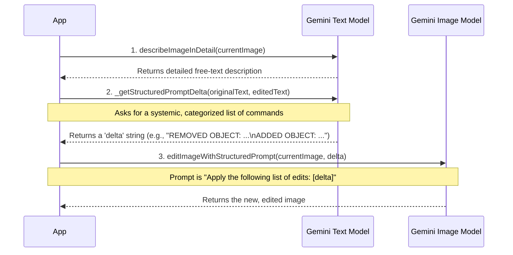
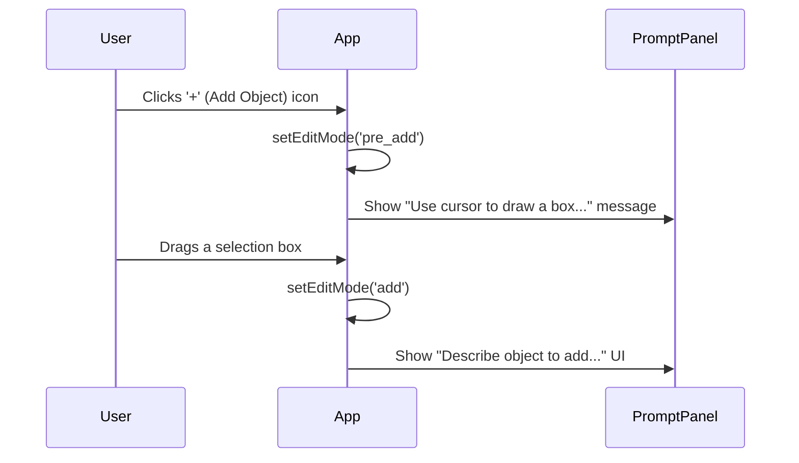
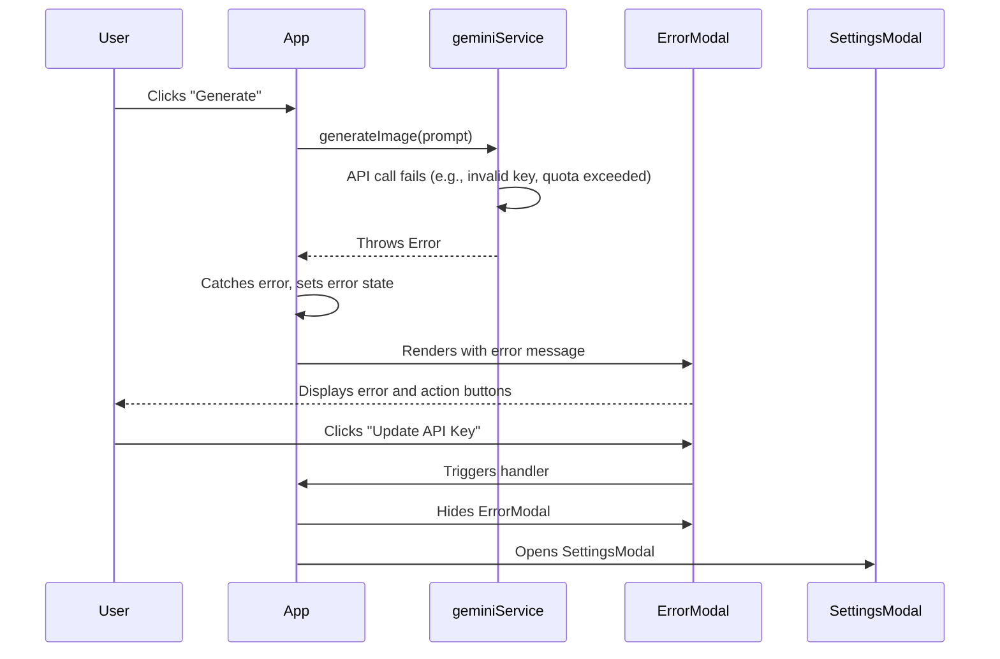

# Engineering Design Document: Banana Peel

**Version:** 1.2
**Date:** 2023-12-08
**Author:** World-Class Senior Frontend Engineer

## 1. Overview

Banana Peel is a web-based, AI-powered image generation and editing tool. It leverages the Google Gemini API to provide a seamless user experience for creating and manipulating images.

**For a complete and detailed breakdown of all user-facing features, user stories, and product goals, please refer to the [Product Requirements Document (PRODUCT.md)](./PRODUCT.md), which serves as the single source of truth for all product-related information.**

## 2. High-Level Architecture

The application follows a modern, component-based frontend architecture using React. State management is centralized within a main `App` component, which orchestrates data flow between UI components and backend services. The architecture is designed to be modular and maintainable, separating concerns between UI, state, and service logic.

### Architectural Diagram

```mermaid
graph TD
    subgraph "User Interface (View)"
        UI_User[User] --> PromptPanel;
        UI_User --> CanvasArea;
        UI_User -- Toggles --> LogViewer;
        LogViewer -- Opens --> ApiInspectorModal;
        UI_User -- Enters key --> SettingsModal;
        UI_User -- Confirms --> ConfirmationModal;
        PromptPanel -- Opens --> ExpandedEditModal;
        App -- Shows Error --> ErrorModal;
        
        subgraph "Editing State UI"
            direction TB
            CanvasHeader["Canvas Header<br/>(Undo, Redo, Download)"]
            CanvasArea;
            CanvasHeader --> CanvasArea
        end

        PromptPanel -- Triggers Handlers --> App;
        CanvasArea -- onSelect event --> App;
    end

    subgraph "Application Core (Controller/State)"
        App[App.tsx<br/><i>Central State & Logic<br/>(Incl. Session API Key)</i>];
    end

    subgraph "Services (Model/Logic)"
        GeminiService[geminiService.ts<br/><i>Gemini API Abstraction</i>];
        ImageUtils[imageUtils.ts<br/><i>Image Processing Utilities</i>];
        LoggerService[logger.ts<br/><i>Logging Service</i>];
        UsageTracker[usageTracker.ts<br/><i>Persistent Usage Counter</i>];
        ApiHistory[apiCallHistory.ts<br/><i>API 'Flight Recorder'</i>]
        GeminiAPI[Google Gemini API<br/><i>External Service</i>];
    end

    subgraph "Testing"
        TestHarness[TestHarness.tsx];
        TestScript[test-script.ts];
        App -- Provides Handles --> TestHarness;
        TestHarness -- Executes --> TestScript;
    end

    App -- Renders & Controls --> PromptPanel;
    App -- Renders & Controls --> CanvasHeader;
    App -- Renders & Controls --> CanvasArea;
    App -- Renders & Controls --> LogViewer;
    App -- Renders & Controls --> SettingsModal;
    App -- Renders & Controls --> ConfirmationModal;
    App -- Renders & Controls --> ApiInspectorModal;
    App -- Renders & Controls --> ExpandedEditModal;
    App -- Renders & Controls --> ErrorModal;
    App -- Calls --> GeminiService;
    App -- Calls --> ImageUtils;
    App -- Configures --> LoggerService;
    App -- Reads from --> UsageTracker;
    LoggerService -- Pushes Logs --> App;
    ApiHistory -- Pushes History --> App;

    GeminiService -- Records to --> ApiHistory;
    GeminiService -- Updates --> UsageTracker;
    GeminiService -- HTTP Requests --> GeminiAPI;
    SettingsModal -- Saves to --> App;
    ErrorModal -- Triggers --> SettingsModal;

    style App fill:#f9f,stroke:#333,stroke-width:2px
    style GeminiService fill:#bbf,stroke:#333,stroke-width:2px
    style ImageUtils fill:#bbf,stroke:#333,stroke-width:2px
    style LoggerService fill:#bbf,stroke:#333,stroke-width:2px
    style UsageTracker fill:#bbf,stroke:#333,stroke-width:2px
    style ApiHistory fill:#bbf,stroke:#333,stroke-width:2px
```

## 3. Key Services & Workflows

This section details the core logic, services, and API interactions that power the application's features.

### 3.1. API Key & Usage Management

This system is designed to provide a seamless experience for new users while guiding them to use their own API key for extended use.

*   **API Key Management:**
    *   **Decision:** User-provided API keys are **session-only**. They are stored in the `App.tsx` component's state and are **not** persisted in `localStorage`.
    *   **Rationale:** This is a more secure and user-friendly approach. It prevents sensitive keys from being stored long-term in the browser and ensures a clean state on each new visit.
*   **Default Key Rate Limiting:**
    *   **Mechanism:** A persistent counter is managed by `utils/usageTracker.ts`, which uses `localStorage`. This counter tracks the number of API calls made using the application's default (fallback) key.
    *   **Limit:** The limit is set to 6 free uses.
    *   **Enforcement:** The `callApiWithRetry` utility in `geminiService.ts` is the central enforcement point. Before any call, it checks if the default key is being used and if the count has been exceeded.
    *   **User Flow:** If the limit is reached, or if the default key hits a remote quota/billing error, a specific, user-friendly error is thrown. This error is caught by the UI and displayed in the `ErrorModal`, which guides the user to the `SettingsModal` to enter their own key.

### 3.2. Gemini Service (`geminiService.ts`)

This module is the abstraction layer for all communication with the Google Gemini API. All exported functions now require an `apiKey` and `keyType` to be passed in, making the service stateless and dependent on the `App` component for key management.

#### 3.2.1. `describeObject`
*   **Purpose:** To identify the main object within a cropped image.
*   **Prompt Engineering:** The prompt is designed for brevity and to cleanly differentiate between an object and "background".

#### 3.2.2. Object Deletion Workflow
*   **Purpose:** To intelligently remove a selected object and realistically fill in the background.
*   **Architecture:** This is a robust, multi-step workflow that combines AI generation with deterministic client-side processing for maximum reliability.
    *   **Step 1: `createPreciseMask` (AI):** The cropped image of the object is sent to the AI with a prompt to generate a high-fidelity, black-and-white silhouette mask. The prompt uses an "expert graphic artist" persona for high quality.
    *   **Step 2: Client-Side Cleaning (`binarizeMask`):** The generated mask is programmatically cleaned to be purely black and white, removing any gray pixels or anti-aliasing.
    *   **Step 3: Client-Side Validation (`analyzeMask`):** The cleaned mask is analyzed. If it's found to be invalid (e.g., all black), the system gracefully falls back to using a simple, reliable rectangular mask (`createMaskFromBox`).
    *   **Step 4: Client-Side Scaling & Compositing (`scaleImage`, `compositeMask`):** The valid mask is programmatically scaled to the exact dimensions of the user's selection box, then composited onto a full-size black canvas to create the final "global mask".
    *   **Step 5: `inpaintBackground` (AI):** The original image and the final global mask are sent to the AI. The prompt is highly explicit, defining the inputs and using a strong negative constraint (e.g., "The filled-in area MUST NOT contain a red square") to ensure the object is not re-generated.

#### 3.2.3. `addObjectToImage`
*   **Purpose:** To add a new object into a specified rectangular area.
*   **Architecture:** Uses a reliable client-generated box mask to define location and size.
*   **Prompt Engineering:** The prompt is procedural and includes a `CRITICAL INSTRUCTION` to prevent the AI from rendering the mask in the final image.

#### 3.2.4. Object Modification Workflow ("Smart Pre-processor" Architecture)
*   **Purpose:** To modify a selected object based on a user's natural language command.
*   **Architecture:** This workflow was refactored into a more robust, two-step "Smart Pre-processor / Dumb Executor" architecture. This separates the complex task of language interpretation from the task of image manipulation, significantly improving reliability.
    *   **Step 1: `preprocessUserPrompt` (The "Smart" Step):**
        *   The user's raw, natural-language prompt is sent to a text-only Gemini model.
        *   The prompt for this step is highly engineered to act as an **expert instruction interpreter**. It explicitly tells the model to resolve all ambiguities and relative terms (e.g., "make it bigger", "move it left") in the context of the original object's mask.
        *   It outputs a structured, unambiguous JSON object with precise instructions (e.g., `{"scale": "make it bigger than mask scale"}`).
    *   **Step 2: `addModifiedObject` (The "Dumb" Executor):**
        *   This multi-modal function receives the background, mask, reference object, and the **pre-processed JSON** from Step 1.
        *   Its prompt is now dramatically simplified. It is a direct, procedural instruction that tells the model to execute the precise content, location, scale, and rotation commands from the JSON, with no room for interpretation.
*   **Rationale:** This separation of concerns is a key architectural decision. By letting a text model handle the nuanced language interpretation and the image model handle the direct visual execution, each model operates in its area of strength. This trades a small amount of latency (for the extra API call) for a massive gain in reliability and predictability.

### 3.3. Structured Edit Workflow

This is a powerful editing feature that relies on a multi-step AI process.



*   **`describeImageInDetail`**: The first step. It generates a detailed, editable description of the current scene.
*   **`_getStructuredPromptDelta`**: The core "diffing" engine. It uses a definitive, maximally robust prompt that instructs the model to act as an **expert prompt engineer** and generate a list of direct, imperative commands.
*   **`editImageWithStructuredPrompt`**: Orchestrates the workflow, first getting the categorized list of commands, then passing that list to the image model.

#### **Structured Prompt Caching**
To improve performance, the result of `describeImageInDetail` is cached. The generated description is stored directly on the `history` state object corresponding to the image. When the user toggles to "Structured" mode, the application first checks for this cached value. If found, it's used instantly, avoiding a redundant API call. The cache is naturally invalidated when the user Undo/Redo's to a different image, as the application will then check the history entry for that specific image.

### 3.4. Image Utilities (`imageUtils.ts`)

This module contains client-side helper functions for image manipulation.
*   `createMaskFromBox`: A simple, 100% reliable function that generates a rectangular mask from a bounding box. Used as a fallback.
*   `binarizeMask`: Cleans an AI-generated mask to be purely black-and-white.
*   `scaleImage`: Programmatically resizes a mask to match the user's selection dimensions.
*   `compositeMask`: Assembles the final global mask by placing the scaled object mask onto a full-size canvas.
*   `analyzeMask`: A diagnostic utility to validate the integrity of an AI-generated mask.

### 3.5. Guided "Add Object" Workflow

This workflow provides an intuitive way for users to add new objects.



### 3.6. Proactive API Error Workflow

This workflow ensures a smooth user experience when API calls fail by providing a unified, actionable error modal.



## 4. State Management

The application's state is managed within the `App.tsx` component. Key patterns include the `stateRef` for preventing stale closures and the use of an **atomic snapshot** for the deletion workflow to ensure data consistency.

The history state has been enhanced to support caching of structured prompts. Each history entry can now hold an optional `structuredDescription`, which is populated on-demand to improve performance.

## 5. Architectural Decisions & Rationale

This section documents key architectural decisions.

### 5.1. Single Source of Truth for Image Dimensions
*   **Decision:** All editing API calls are constrained by a single set of dimensions (`sessionImageDimensions`).
*   **Rationale:** To prevent "generative drift" in the AI's output dimensions.

### 5.2. Mandatory, On-Demand API Client
*   **Decision:** The Gemini API client is created just-in-time for each API call, using either the user-provided session key or the default app key.
*   **Rationale:** This makes key management flexible and stateless at the service layer. The UI layer (`App.tsx`) is responsible for deciding which key to use, promoting a clear separation of concerns.

### 5.3. Abandoning Complex Mask Generation for a Multi-Step Workflow
*   **Decision:** The initial approach of a single, complex mask generation API call was abandoned in favor of a more robust, multi-step process that combines a simpler AI mask generation with deterministic client-side validation, cleaning, and fallback logic.
*   **Rationale:** A single AI call for mask generation proved to be a non-deterministic point of failure. The new multi-step architecture is significantly more resilient. It leverages the AI for what it's good at (generating a silhouette) but uses reliable client-side code to handle critical tasks like cleaning, scaling, and validation, including a guaranteed-to-work fallback to a simple box mask. This makes the entire deletion and modification workflow faster and more reliable.