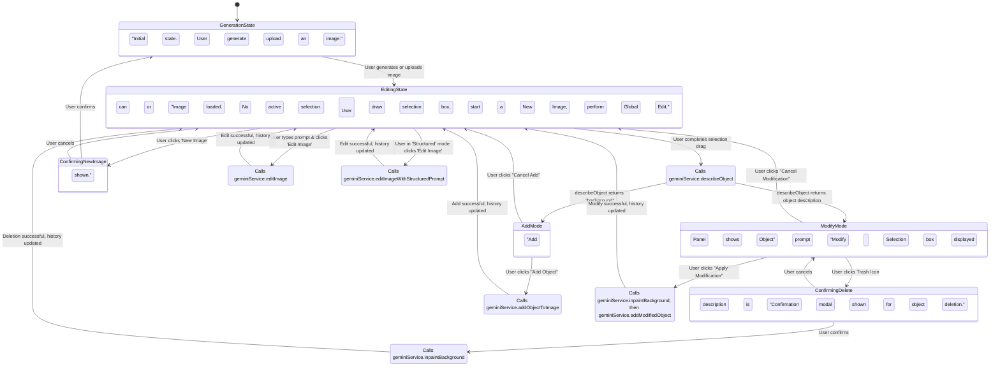
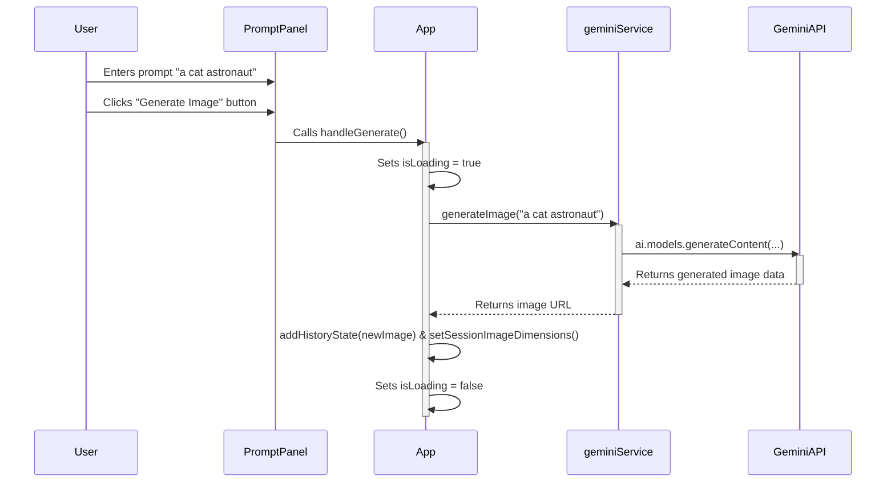
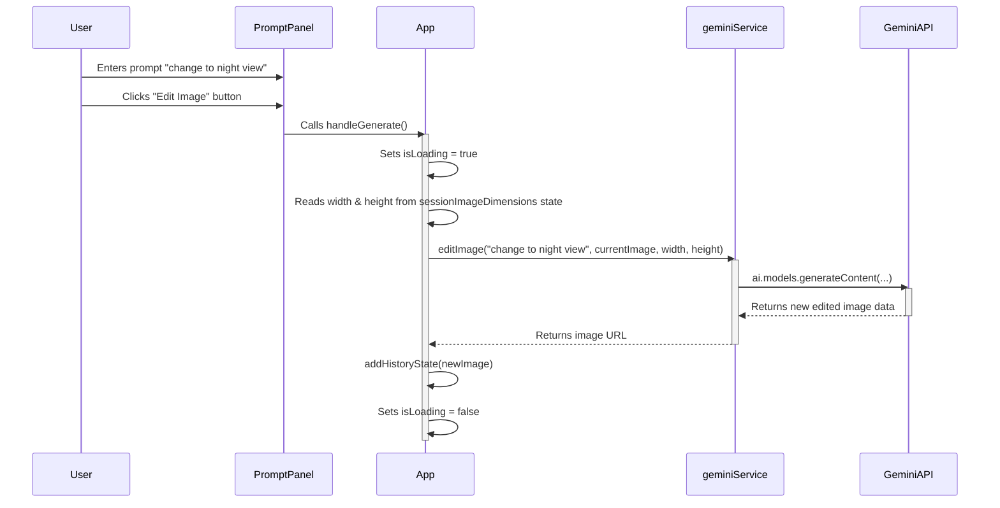
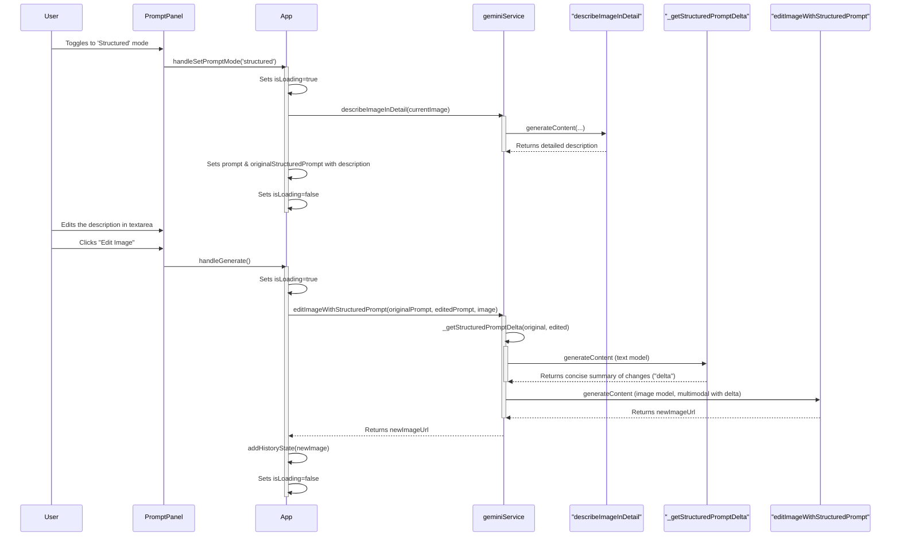

# Engineering Design Document: Banana Peel

**Version:** 1.0
**Date:** 2023-10-27
**Author:** World-Class Senior Frontend Engineer

## 1. Overview

Banana Peel is a web-based, AI-powered image generation and editing tool. It leverages the Google Gemini API to provide a seamless user experience for creating and manipulating images.

**For a complete and detailed breakdown of all user-facing features, user stories, and product goals, please refer to the [Product Requirements Document (PRODUCT.md)](./PRODUCT.md), which serves as the single source of truth for all product-related information.**

## 2. High-Level Architecture

The application follows a modern, component-based frontend architecture using React. State management is centralized within a main `App` component, which orchestrates data flow between UI components and backend services. The architecture is designed to be modular and maintainable, separating concerns between UI, state, and service logic.

### Architectural Diagram

This diagram illustrates the main components and their relationships. The UI is now split into two main states: a "Generation" state for starting new work, and an "Editing" state which includes a dedicated header for canvas-related controls.

```mermaid
graph TD
    subgraph "User Interface (View)"
        UI_User[User] --> PromptPanel;
        UI_User --> CanvasArea;
        UI_User -- Toggles --> LogViewer;
        LogViewer -- Opens --> ApiInspectorModal;
        UI_User -- Enters key --> SettingsModal;
        UI_User -- Confirms --> ConfirmationModal;
        
        subgraph "Editing State UI"
            direction TB
            CanvasHeader["Canvas Header<br/>(Undo, Redo, Download)"]
            CanvasArea;
            CanvasHeader --> CanvasArea
        end

        PromptPanel -- Triggers Handlers --> App;
        CanvasArea -- onSelect event --> App;
    end

    subgraph "Application Core (Controller/State)"
        App[App.tsx<br/><i>Central State & Logic</i>];
    end

    subgraph "Services (Model/Logic)"
        GeminiService[geminiService.ts<br/><i>Gemini API Abstraction</i>];
        ImageUtils[imageUtils.ts<br/><i>Image Processing Utilities</i>];
        LoggerService[logger.ts<br/><i>Logging Service</i>];
        ApiKeyStore[apiKeyStore.ts<br/><i>LocalStorage Wrapper</i>];
        ApiHistory[apiCallHistory.ts<br/><i>API 'Flight Recorder'</i>]
        GeminiAPI[Google Gemini API<br/><i>External Service</i>];
    end

    subgraph "Testing"
        TestHarness[TestHarness.tsx];
        TestScript[test-script.ts];
        App -- Provides Handles --> TestHarness;
        TestHarness -- Executes --> TestScript;
    end

    App -- Renders & Controls --> PromptPanel;
    App -- Renders & Controls --> CanvasHeader;
    App -- Renders & Controls --> CanvasArea;
    App -- Renders & Controls --> LogViewer;
    App -- Renders & Controls --> SettingsModal;
    App -- Renders & Controls --> ConfirmationModal;
    App -- Renders & Controls --> ApiInspectorModal;
    App -- Calls --> GeminiService;
    App -- Calls --> ImageUtils;
    App -- Configures --> LoggerService;
    LoggerService -- Pushes Logs --> App;
    ApiHistory -- Pushes History --> App;

    GeminiService -- Records to --> ApiHistory;
    GeminiService -- Reads from --> ApiKeyStore;
    GeminiService -- HTTP Requests --> GeminiAPI;
    SettingsModal -- Saves to --> ApiKeyStore;

    style App fill:#f9f,stroke:#333,stroke-width:2px
    style GeminiService fill:#bbf,stroke:#333,stroke-width:2px
    style ImageUtils fill:#bbf,stroke:#333,stroke-width:2px
    style LoggerService fill:#bbf,stroke:#333,stroke-width:2px
    style ApiHistory fill:#bbf,stroke:#333,stroke-width:2px
```



The application exclusively uses the `gemini-2.5-flash-image` model for all image generation and editing tasks, and `gemini-2.5-flash` for text-only tasks like prompt preprocessing. This architectural decision prioritizes model consistency and leverages each model's strengths for the entire user workflow. This is detailed further in section `3.7`.

## 3. Functional Modules

### 3.1. Core Editing Workflow

The primary user workflow involves selecting a part of an image and applying an edit. This flow is stateful, transitioning the application between different editing modes based on the user's selection and the AI's analysis.

#### State Diagram: Editing Flow



### 3.2. Image Generation Sequence

This sequence diagram details the process of generating a new image from a text prompt when no image is currently loaded.

#### Sequence Diagram: New Image Generation



### 3.3. Object Modification Sequence

This sequence describes the more complex workflow of selecting an existing object and applying a targeted modification. It features a robust, multi-call API process to improve reliability by separating background inpainting from object modification.

#### Sequence Diagram: Object Modification

```mermaid
sequenceDiagram
    participant User
    participant CanvasArea
    participant PromptPanel
    participant App
    participant geminiService
    participant GeminiAPI_Text
    participant GeminiAPI_Image

    User->>CanvasArea: Drags to select an object
    CanvasArea->>App: onSelect(boundingBox)
    activate App
    App->>App: Enters "ProcessingSelection" state
    App->>geminiService: describeObject(...)
    geminiService-->>App: returns description (e.g., "red square")
    App->>App: Enters "ModifyMode"
    deactivate App

    User->>PromptPanel: Enters prompt "make it purple"
    User->>PromptPanel: Clicks "Apply Modification"
    PromptPanel->>App: handleGenerate()
    activate App
    App->>App: Sets isLoading = true
    App->>geminiService: preprocessUserPrompt("make it purple")
    activate geminiService
    geminiService->>GeminiAPI_Text: generateContent (text model)
    GeminiAPI_Text-->>geminiService: returns structured JSON
    deactivate geminiService
    geminiService-->>App: returns preprocessed prompt object
    deactivate geminiService
    
    App->>App: Prepares image data (crop, mask, etc.)
    App->>geminiService: inpaintBackground(...)
    activate geminiService
    geminiService->>GeminiAPI_Image: generateContent (image model, multimodal)
    GeminiAPI_Image-->>geminiService: returns inpaintedImageUrl
    deactivate geminiService
    geminiService-->>App: returns inpaintedImageUrl
    
    App->>geminiService: addModifiedObject(...)
    activate geminiService
    geminiService->>GeminiAPI_Image: generateContent (image model, multimodal)
    GeminiAPI_Image-->>geminiService: returns finalImageUrl
    deactivate GeminiAPI_Image
    geminiService-->>App: returns finalImageUrl
    deactivate geminiService
    
    App->>App: addHistoryState(finalImage)
    App->>App: Sets isLoading = false, clears selection
    deactivate App
```

### 3.4. Global Edit Sequence

This new sequence diagram details the workflow for applying a modification to the entire image when no specific object is selected.

#### Sequence Diagram: Global Image Edit



### 3.5. Structured Prompt Edit Sequence

This new sequence diagram details the "describe then delta" workflow for the Structured Prompt feature. This two-call API process is designed for precision editing.

#### Sequence Diagram: Structured Prompt Edit




### 3.6. State, History, and Logging Management

*   **Image History:** State is managed reactively. The `currentImage` is derived from the `history` array and the `historyIndex`. This design ensures that UI updates are a direct result of state changes and makes features like Undo/Redo straightforward to implement.
*   **Session Logging:** The `LoggerService` acts as a publisher. The `App` component subscribes to it by providing a callback function (`addOutput`). When any service calls `logger.info()`, the `LoggerService` iterates through its subscribers and calls their callbacks. The `App` component's callback appends the received log message to its `sessionLogs` state array, which is then passed as a prop to the `LogViewer`. This decouples log generation from consumption.

#### Flowchart: Undo/Redo Logic

```mermaid
graph TD
    subgraph Undo Operation
        A[User Clicks Undo] --> B{canUndo? (historyIndex > 0)};
        B -- Yes --> C[setHistoryIndex(historyIndex - 1)];
        B -- No --> D[No Action];
        C --> E[UI re-renders with previous image];
    end

    subgraph Redo Operation
        F[User Clicks Redo] --> G{canRedo? (historyIndex < history.length - 1)};
        G -- Yes --> H[setHistoryIndex(historyIndex + 1)];
        G -- No --> I[No Action];
        H --> J[UI re-renders with next image];
    end
```

### 3.7. Testing Interface (`stateRef` Pattern)

*   **Problem:** The `TestHarness` component operates outside the standard React update flow. It needs a way to synchronously read the latest state of the `App` component to validate the results of its actions. A naive approach where `App` passes a `getState` function directly can lead to that function having a **stale closure**—a "snapshot" of the state from a previous render, which causes tests to fail with timeouts because they never see the updated state.

*   **Architectural Solution:** To solve this, we implement the `stateRef` pattern. This is a core architectural decision for ensuring testability.
    1.  **`useRef` as a Stable Container:** A `useRef` hook (`stateRef`) is created in the `App` component. A ref object is a stable container that persists for the full lifetime of the component; its `.current` property is mutable.
    2.  **State Synchronization:** On *every render* of `App.tsx`, the `stateRef.current` property is updated with an object containing all the latest state variables (`prompt`, `history`, `isLoading`, etc.).
    3.  **Stable `getState` Handle:** The `getState` function provided to the `TestHarness` is memoized. Its only job is to return the value of `stateRef.current`.

*   **Asynchronous State & Test Reliability:** The test script must account for the asynchronous nature of React's state updates. Simply calling an action handle (e.g., `handles.setPrompt()`) and then immediately calling another handle (e.g., `handles.generate()`) will create a race condition, as the second call may execute before React has re-rendered the component.
    *   **Solution Pattern:** To prevent this, the test script MUST use a `pollForState` helper function. After dispatching a state-changing action, the script must `await pollForState(...)` to verify that the application state (read via the `stateRef` pattern) has been successfully updated before proceeding to the next step. This is a critical practice for the reliability of the entire test suite.

*   **Result & Criticality:** The combination of the `stateRef` pattern in the app and the `pollForState` pattern in the test script creates a robust and reliable testing interface. This architecture is **critical for preventing race conditions and stale state issues** and must not be altered.

### 3.8. Gemini API Prompt Engineering

The reliability and accuracy of the application's features are highly dependent on the precise wording of the prompts sent to the Gemini API. This section documents the rationale behind the key prompts.

#### 3.8.1. The 'Pixels vs. Objects' Challenge

*   **Traditional Object-Based Editing:** Software like Adobe Illustrator or Figma operates on a vector or object model. An image is a collection of discrete, mathematical objects (shapes, text boxes, paths) with defined properties like color, size, and position. When a user clicks an object and issues a command like "move left," the software deterministically modifies that object's `x` coordinate property. The edit is precise and isolated because the software has a structured understanding of the scene's components.

*   **Generative AI's Pixel-Based Representation:** In contrast, generative models like Gemini perceive an image not as a collection of objects, but as a holistic grid of pixels. The model's "understanding" comes from statistical patterns, textures, and relationships learned from its vast training data. It doesn't inherently know that a certain cluster of pixels *is* a "chair" with its own distinct boundaries and properties. It only knows that those pixel patterns are statistically associated with the concept of a chair.

*   **The Resulting Challenge:** This fundamental difference makes precise editing with a simple text prompt challenging. A command like "move the chair to the right" is ambiguous to a model that doesn't see a discrete "chair" object. It might misinterpret the request, move the wrong pixels, create a second chair, or alter the background incorrectly because it lacks the context of a defined, isolated object.

*   **Our Architectural Solution:** Banana Peel's architecture is explicitly designed to bridge this conceptual gap. We use a multi-step, multimodal prompting strategy to provide the model with the concrete, pixel-level guidance it needs:
    1.  **Object Identification:** We first identify the object with `describeObject`.
    2.  **Visual Prompting with Masks:** We then generate a `preciseMask`. This mask is a critical piece of visual information. When we send this mask along with the original image, we are not just *telling* the model where the object is with words; we are *showing* it the exact pixels that constitute the object to be modified.
    3.  **Targeted Instruction:** This "visual prompting" transforms an ambiguous request into a precise one. The model is no longer guessing; it is given clear instructions to operate only within the white area of the provided mask, dramatically improving the reliability and accuracy of targeted edits.

#### 3.8.2. `describeObject`
*   **Goal:** To determine if a user's selection contains a distinct object or is just background, driving the `modify` vs. `add` edit modes.
*   **Prompt Text:** `"Your task is to identify and describe the main object in this image. Use 3 words or less. Be specific about simple geometric shapes (e.g., "red square", "blue circle"). If the image consists only of empty space or a uniform texture with no discernible object, respond with only the word "background"."`
*   **Rationale:**
    *   `"3 words or less"`: Keeps the description concise for UI display.
    *   `"Be specific about simple geometric shapes"`: Critical for the test suite to pass reliably.
    *   `"...respond with only the word 'background'"`: This is the key instruction. The application's logic hinges on detecting this exact keyword to switch into "Add" mode.

#### 3.8.3. `createPreciseMask`
*   **Goal:** To generate a precise, positionally-accurate segmentation mask, with a graceful fallback if the model cannot perform the task.
*   **Prompt Text:** `"Your primary objective is to determine if a high-fidelity segmentation mask can be created for the '${objectDescription}' in the provided image. **Condition 1: If a clear, unambiguous mask IS possible:** - Generate an image with a solid, pure dark black background (#000000). - On this background, draw a solid white silhouette... CRITICAL: The white silhouette's position, size, and shape must be an exact one-to-one match... **Condition 2: If the object's borders are too ambiguous...:** - You MUST abandon image generation. - Your ONLY response must be the exact text: MASK_GENERATION_FAILED"`
*   **Rationale:** This prompt is architecturally significant. It gives the model explicit permission to fail gracefully.
    *   **The Fallback Mechanism:** The application logic in `geminiService.ts` is designed to detect the `MASK_GENERATION_FAILED` response. If it receives this signal, it returns `null`. The calling function in `App.tsx` then triggers a client-side fallback, calling `imageUtils.createMaskFromBox` to generate a simple, reliable rectangular mask based on the user's original selection.
    *   **Robustness:** This two-pronged strategy (AI-first, client-fallback) makes the editing workflow significantly more robust, ensuring that the user can always proceed with an edit even if the AI struggles with an ambiguous object.
    *   **Positional Accuracy:** The prompt retains the critical instructions from the previous version to prevent positional drift when the AI-generated mask is successful.

#### 3.8.4. Inpainting and Object Modification
*   **Goal:** To reliably modify an object in-place while preserving the background and aspect ratio.
*   **Problem:** A single API call to modify an object often resulted in "Generative Drift"—unwanted changes to the background, aspect ratio, or object duplication.
*   **Solution Architecture:** A two-call API process was implemented to separate concerns and provide the model with clearer instructions.
    1.  **`inpaintBackground`:** The first call removes the object entirely and fills in the background. This creates a clean slate for the second step.
    2.  **`addModifiedObject`:** The second call takes the clean background, a reference image of the original object, a mask defining the target location, and the user's structured prompt. This provides maximum context to the model, allowing it to focus solely on modifying and placing the object.
*   **The "Single Source of Truth for Dimensions" Pattern:** To definitively solve aspect ratio drift, the application stores the dimensions of the very first image in a session in a `sessionImageDimensions` state variable. These stored, unchanging dimensions are used as an absolute, non-negotiable constraint in the prompt for every subsequent API call.
*   **Key Prompt Snippets:**
    *   **`inpaintBackground` Prompt:** `"Critical Constraint: The final output image MUST have a width of [width] pixels and a height of [height] pixels. This is a non-negotiable requirement. You will be given two images as input: 1. An **Original Image**... 2. A **Mask Image**... Your task is to analyze these inputs and generate a new version of the Original Image where the object defined by the white area...has been completely removed. You must realistically fill in the background..."`
    *   **`addModifiedObject` Prompt:** `"Critical Constraint: The final output image MUST have a width of [width] pixels and a height of [height] pixels... Your task is to modify a reference object and place it onto a background image... First, apply the 'Content Change': '[from JSON]'... Next, apply the following spatial transformations... Finally, place this newly modified object onto the background image..."`
*   **Rationale Summary:** This multi-call, multi-modal architecture with a stable dimension constraint transforms an ambiguous request into a highly specific, procedural one. It is the definitive solution to "Generative Drift" and is critical for the application's reliability.

## 4. Key Services & Utilities

### 4.1. `geminiService.ts`

*   **Responsibility:** Acts as an abstraction layer over the `@google/genai` SDK. It encapsulates all API call logic, including model names, request body formatting, and response parsing. It is now also instrumented to record the full context of every call to the `apiCallHistory` service for debugging.
*   **Architectural Pattern (API Key):** The service no longer maintains a single, persistent client instance. Instead, a `getGenAIClient()` factory function is called at the beginning of every API request. This function creates a new `GoogleGenAI` client "just-in-time". It first checks for a user-provided API key in `localStorage` (via `apiKeyStore.ts`). If a user key is present, it's used; otherwise, the client falls back to the `process.env.API_KEY`. This on-demand pattern ensures that any changes to the user's API key are immediately reflected in the next API call without requiring a page refresh.
*   **Error Handling:** Implements a `callApiWithRetry` utility with exponential backoff for handling rate limiting (429) and transient server errors (500/503), improving application resilience. It does not retry on client-side errors like invalid API keys (403).

### 4.2. `imageUtils.ts`

*   **Responsibility:** Provides a suite of pure functions for client-side image manipulation. These operations are performed in the browser to prepare data for API calls or display.
*   **Key Functions:** `fileToBase64`, `cropImage`, `createFullSizeMask`, `createMaskFromBox`, `getImageDimensions`.
*   **Design:** These functions are asynchronous and return Promises, leveraging browser APIs like `FileReader`, `Image`, and `Canvas`.

### 4.3. `logger.ts`

*   **Responsibility:** A centralized, singleton logging service (`LoggerService`). It standardizes log formatting and allows for dynamic log level control.
*   **Design:** A publish-subscribe model. The service maintains a list of output functions (`outputs`) that can be added or removed at runtime. It also supports a special, exclusive `testHarnessOutput`. This decouples log generation from log consumption, allowing logs to be sent to the console, the UI, and the test harness simultaneously and independently. This architecture is critical for ensuring the downloadable logs feature and the test harness do not conflict.

### 4.4. `apiKeyStore.ts`

*   **Responsibility:** A simple abstraction layer over the browser's `localStorage` API. It is dedicated solely to managing the user's Gemini API key.
*   **Design:** Exposes three pure functions (`getApiKey`, `setApiKey`, `hasApiKey`) to provide a clean, centralized, and testable interface for API key storage, preventing direct `localStorage` calls from scattering across the codebase.

### 4.5. `apiCallHistory.ts`

*   **Responsibility:** Acts as a "flight recorder" for all interactions with the Gemini API. It maintains a rolling in-memory store of the last five API calls.
*   **Design:** A singleton, stateful utility that uses a publish-subscribe pattern. The `geminiService` calls `addApiCallRecord` to push a new record. This utility then notifies all subscribed listeners (primarily the `App` component) that new data is available. This decoupled design allows the `geminiService` to remain unaware of the UI, while enabling the UI to reactively update when new call data is recorded.

## 5. Architectural Decisions & Rejected Proposals

This section documents significant architectural decisions, including the rationale for choosing certain patterns and rejecting others.

### 5.1. On-Screen Transform Handles (Rejected)

*   **Proposal:** An experimental feature (`TransformableObject.tsx`) was built to allow direct, on-canvas manipulation of a selected object's position, scale, and rotation using draggable UI handles.
*   **Decision:** The feature was **rejected and reverted**.
*   **Rationale:** This feature created a fundamental architectural conflict between the application's client-side UI and the generative model's server-side reality.
    *   **The "UI State vs. Pixel Reality" Mismatch:** The on-screen handles operate on a vector-like transform model (x, y, scale, rotation). The generative AI, however, operates on a pixel-based model. There is no direct, deterministic way to translate the UI's transform state into a guaranteed visual outcome from the AI.
    *   **Poor User Experience:** Each small adjustment of a handle would require a full round-trip to the API, resulting in high latency and cost. Furthermore, the AI might not perfectly respect the requested transformation, leading to a frustrating experience where the rendered image does not match the position of the UI handles.
    *   **Conclusion:** The text-prompt-based modification workflow, while less direct, is more honest about the probabilistic nature of generative AI and provides a more reliable and predictable user experience. The on-screen handles created a promise of direct manipulation that the underlying technology could not consistently deliver.

### 5.2. Single-Call vs. Multi-Call Object Modification

*   **Proposal (Initial):** The first implementation of object modification used a single, complex API call that provided the original image, a mask, a reference object, and the text prompt all at once.
*   **Decision:** This was **rejected and refactored** into the current multi-call process (inpaint, then add/modify).
*   **Rationale:** The single-call approach, while seemingly more efficient, proved to be unreliable. The prompt was too complex, often leading the model to misinterpret the instructions, resulting in "generative drift" (unwanted changes to the background or other objects). The current multi-call architecture separates concerns, giving the model a much simpler, more focused task at each step, which dramatically improves the reliability and predictability of the final result.