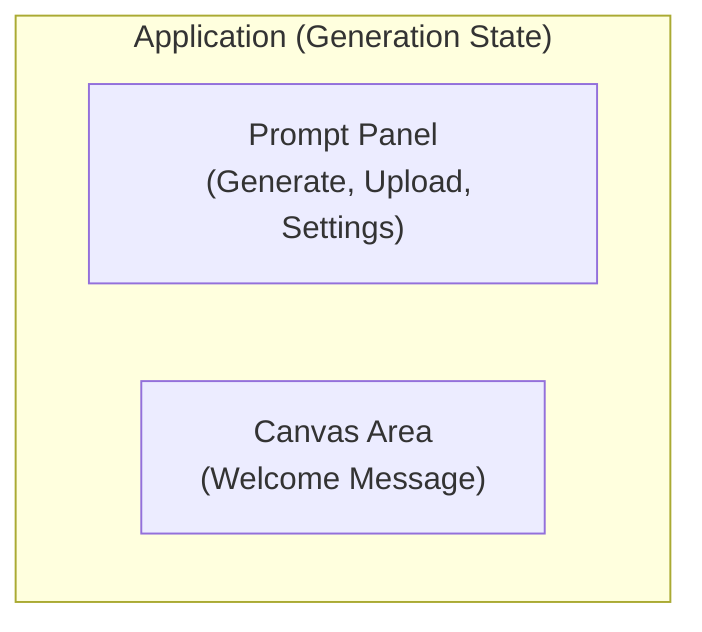
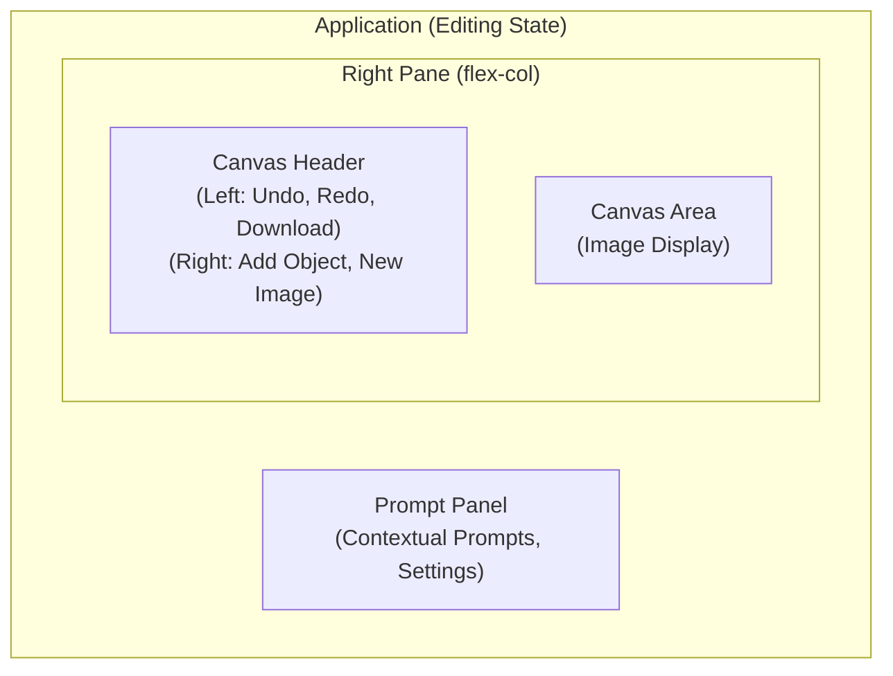

# UI Design & Interaction Guide: Banana Peel

**Version:** 1.0
**Date:** 2023-10-27

## 1. Design Philosophy

The UI for Banana Peel is guided by three core principles:

1.  **Minimalist & Content-Focused:** The interface is designed to be clean and unobtrusive, keeping the user's image (the content) as the primary focus. Controls are consolidated and context-aware.
2.  **Intuitive & Discoverable:** All actions should be clear from the context. The UI adapts to the user's current task (generating, modifying, adding), guiding them with clear labels and button states.
3.  **Clear & Immediate Feedback:** The application must always communicate its state to the user. Loading indicators, disabled buttons, and descriptive text prevent confusion during asynchronous operations.

## 2. Core Layout & UI States

The application now operates in two distinct states: "Generation" and "Editing". This separation provides a clearer, more focused workflow for the user. The core layout remains a two-column design but adapts based on the current state.

### 2.1. "Generation" State (Initial State)

This is the default state. The layout is simple, focused on getting the user to create their first image.



### 2.2. "Editing" State

This state is active once an image is on the canvas. The layout expands to include a dedicated header for canvas-related actions.



## 3. Component Deep Dive

### 3.1. Prompt Panel (`PromptPanel.tsx`)

This is the primary user interaction hub. Its appearance and available actions change dynamically based on the application's state.

*   **Header:** Contains the app title and a new **Settings Icon** button, which opens the API Key Settings modal.
*   **Prompt Mode Toggle:** In the "Editing" state, a "Freeform" / "Structured" toggle bar appears above the main text area. Next to it is a new **Expand Icon** button, which opens the `ExpandedEditModal`. Both are disabled while a structured prompt is being generated.
*   **Buttons:**
    *   In "Generation" state, the user sees "Generate Image" and "Upload an Image".
    *   In "Editing" state, the "Upload" button is hidden. The primary button becomes "Edit Image", which changes to "Apply Modification" or "Add Object" during a selection workflow.
*   **Dynamic Prompt Height:** The prompt `textarea` is context-aware. It has a standard height by default, but shrinks to a smaller height during a sub-editing workflow (`'modify'` or `'add'` mode).
*   **Scrollability:** The entire panel, from the header to the buttons at the bottom, scrolls as a single unit when content overflows.

#### State Diagram: Prompt Panel UI

This diagram illustrates how the Prompt Panel's UI changes based on the user's actions.

```mermaid
stateDiagram-v2
    [*] --> GenerationState

    state "Generation State" as GenerationState {
        description Label: "Describe your image"<br/>Button: "Generate Image"<br/>Button: "Upload an Image"
    }
    GenerationState --> EditingState: User generates or uploads image

    state "Editing State (Default)" as EditingState {
        description Label: "Describe your edit"<br/>Toggle: "Freeform" (active)<br/>Button: "Edit Image" <br/>Button: Expand Icon
    }
    EditingState --> ModifyObject: User selects an object
    EditingState --> AddObject: User selects an empty area
    EditingState --> StructuredMode: User toggles to 'Structured'
    EditingState --> PreAdd: User clicks '+' icon in header
    EditingState --> ExpandedEditModal: User clicks 'Expand' icon

    state "Expanded Edit Modal" as ExpandedEditModal {
        description Large Textarea <br/> Toggle: "Freeform"/"Structured" <br/> Button: "Edit Image" <br/>Button: Collapse Icon
    }
    ExpandedEditModal --> EditingState: User clicks "Collapse" or "Edit Image"

    state "Pre-Add State" as PreAdd {
        description Info: "Use your cursor to draw a box..."<br/>Prompt: Disabled<br/>Button: "Cancel Add"
    }
    PreAdd --> AddObject: User selects an area on canvas
    PreAdd --> EditingState: User clicks "Cancel Add"

    state "Structured Mode" as StructuredMode {
        description Label: "Describe your edit"<br/>Toggle: "Structured" (active)<br/>Textarea: Shows detailed description<br/>Button: "Edit Image"
    }
    StructuredMode --> EditingState: User toggles to 'Freeform' or completes edit

    state "Modify Object" as ModifyObject {
        description Label: "Describe your modification"<br/>Header: "Modifying object: [name]"<br/>Textarea Height: Small<br/>Button: "Apply Modification"<br/>Button: "Cancel Modification"<br/>Button: Trash Icon
    }
    ModifyObject --> EditingState: User clicks "Apply" or "Cancel"
    
    state "Add Object" as AddObject {
        description Info: "No object found"<br/>Label: "Describe object to add..."<br/>Textarea Height: Small<br/>Button: "Add Object"<br/>Button: "Cancel Add"
    }
    AddObject --> EditingState: User clicks "Add" or "Cancel"
```

### 3.2. Canvas Area & Header

This is the user's visual workspace. In "Editing" state, it is now preceded by a dedicated header that consolidates all session-level actions.

*   **Canvas Header:**
    *   **Visibility:** Only visible in "Editing" state.
    *   **Layout:** A distinct visual "band" aligned with the canvas. Contains a left-aligned group (Undo, Redo, Download) and a right-aligned group that includes the **Add Object `+` icon** and the "New Image" button.
    *   **Interaction:** All buttons in this header are **disabled** whenever the user is in a sub-editing state (i.e., "Modify Object", "Add Object", or "Pre-Add").
*   **Canvas Area States (`CanvasArea.tsx`):**
    *   **Welcome State:** (In "Generation" state) Displays a welcome message and instructions.
    *   **Image Display State:** (In "Editing" state) The image is displayed. The cursor is a crosshair for selection. In "Pre-Add" state, the crosshair is also active.
    *   **Selection & Loading States:** A dashed box appears on drag. After selection is complete and analyzed, a static dashed yellow box remains to show the active selection. A loading overlay appears during API calls.

### 3.3. Settings Modal (`SettingsModal.tsx`)

A modal component for users to provide their own Gemini API key.

*   **Activation:**
    *   Triggered manually when a user clicks the `SettingsIcon` in the `PromptPanel` header.
    *   Triggered automatically when the user attempts an API call without a key present in local storage.
*   **UI:**
    *   A centered dialog box.
    *   **Title:** "Enter Your Gemini API Key".
    *   **Content:** Provides a secure password input field and clear, step-by-step instructions on how to obtain a key, including a hyperlink to Google AI Studio.
*   **Interaction:**
    *   "Save" stores the key in `localStorage` and closes the modal.

### 3.4. Log Viewer (`LogViewer.tsx`)

This component provides a UI for power users to view and download real-time session logs.

*   **Activation:** The viewer is visible by default.
*   **Interaction:**
    *   The bar can be expanded or collapsed.
    *   A "Dismiss" button hides the viewer for the session.
    *   A new "API Call Inspector" button opens the inspector modal.
    *   A "Download" icon button triggers a `.txt` file download.

### 3.5. Confirmation Modal (`ConfirmationModal.tsx`)

A reusable modal component to confirm critical user actions. Its design is now flexible and adapts based on the action being confirmed.

*   **Standard Confirmation UI (for "New Image"):**
    *   **Title:** "Start a New Image?"
    *   **Message:** "Your current image and history will be lost. This action cannot be undone."
    *   **Buttons:** A "Cancel" button and a "Confirm" button.
*   **User-Choice Deletion UI (for "Delete Object"):**
    *   **Title:** "Please confirm delete"
    *   **Buttons:** "Cancel", "Delete" (for Smart Delete), and a separate "Force Delete" (for Hard Delete).
    *   **Explanatory Text:** A sentence explains the difference between the two delete methods.

### 3.6. API Call Inspector Modal (`ApiCallInspectorModal.tsx`)

This component provides a powerful UI for visually debugging the inputs and outputs of Gemini API calls.

*   **Activation:** Triggered by the "API Call Inspector" button in the `LogViewer`.
*   **Layout:** A large modal with a two-pane view (navigation list on the left, details on the right).
*   **Interaction:** Users can select a call to view its full prompt and download its input/output images.

### 3.7. Expanded Edit Modal (`ExpandedEditModal.tsx`)

A new modal that provides a large, comfortable environment for editing long text prompts, especially for the "Structured" edit mode.

*   **Activation:** Triggered by the new `ExpandIcon` in the `PromptPanel`.
*   **Layout:** A large, responsive modal that overlays the application, taking up `90%` of the viewport width.
    *   **Header:** Contains a "Freeform"/"Structured" toggle and a `CollapseIcon` button to close the modal.
    *   **Main Content:** A large `textarea` that fills most of the modal.
    *   **Footer:** A single "Edit Image" button.
*   **Interaction:**
    *   The toggle and collapse buttons are disabled while a structured prompt is being generated.
    *   Clicking "Edit Image" performs the action and closes the modal.

### 3.8. Test Harness Modal (`TestHarness.tsx`)

This component provides the UI for the developer-facing regression testing suite.

*   **Activation:** Triggered by typing `_run_test_` into the prompt input.
*   **Layout:** A two-pane view (test cases on the left, logs on the right).

### 3.9. Error Modal (`ErrorModal.tsx`)

A new, dedicated modal for displaying API errors in a user-friendly and actionable way.

*   **Activation:** Rendered whenever the main `error` state in `App.tsx` is not null. This unifies all API error handling.
*   **UI:**
    *   **Title:** "An Error Occurred" (in red).
    *   **Content:** A `pre` formatted block displays the specific error message returned from the API.
    *   **Buttons:**
        *   "Cancel": Closes the modal and clears the error state.
        *   "Update API Key": Closes the error modal and opens the `SettingsModal`, providing a direct path to fix authentication/billing issues.

## 4. Visual Style Guide

*   **Color Palette:**
    *   **Background:** Dark Gray (`bg-gray-900`, `bg-gray-800`)
    *   **Accent (Primary Action):** Yellow (`bg-yellow-500`, `text-yellow-300`)
    *   **Text:** White and light grays.
    *   **Error / Destructive Action:** Red (`bg-red-800`, `text-red-400`)
*   **Typography:**
    *   **Font:** Inter.
*   **Iconography:**
    *   **Style:** Outline, stroke-based icons.
    *   **Key Icons:** `Upload`, `Undo`, `Redo`, `Download`, `Settings`, `Trash`, `Plus`, `Expand` (chevrons pointing outward: `< >`), `Collapse` (chevrons pointing inward: `> <`).

## 5. Key Interaction Flows

### 5.1. Generate New Image (First Time User)
1.  User types a prompt.
2.  User clicks "Generate Image".
3.  The API call fails due to a missing key.
4.  The `ErrorModal` appears, showing "API key not found...".
5.  User clicks "Update API Key".
6.  The `ErrorModal` closes, and the `SettingsModal` opens.
7.  User enters their key and clicks "Save".
8.  The `SettingsModal` closes, and the user can now successfully generate an image.

### 5.2. Start New Image from Edit State
1.  User clicks "New Image".
2.  The `ConfirmationModal` appears.
3.  User clicks "Confirm".
4.  The app state is reset, and the UI returns to the "Generation" state.

### 5.3. Select and Modify Object
1.  User drags a rectangle over an object.
2.  The app shows an "Analyzing..." overlay.
3.  The `PromptPanel` switches to "Modify" mode.
4.  User types a modification and clicks "Apply Modification".
5.  The app shows a "Processing..." overlay.
6.  On success, the new image is displayed, and the UI returns to the default "Editing" state.