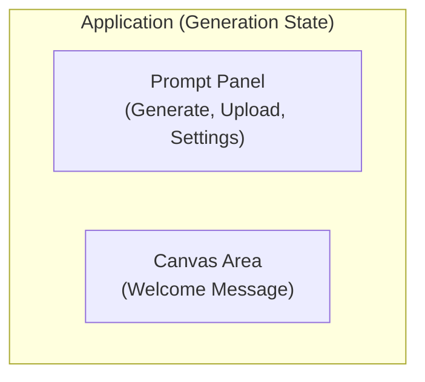
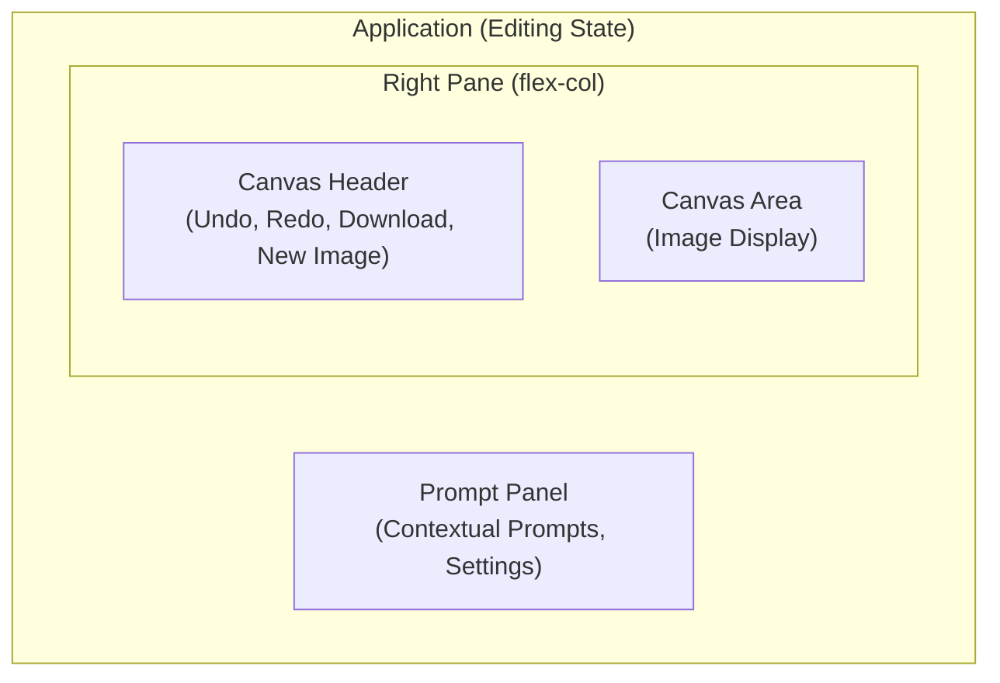

# UI Design & Interaction Guide: Banana Peel

**Version:** 1.0
**Date:** 2023-10-27

## 1. Design Philosophy

The UI for Banana Peel is guided by three core principles:

1.  **Minimalist & Content-Focused:** The interface is designed to be clean and unobtrusive, keeping the user's image (the content) as the primary focus. Controls are consolidated and context-aware.
2.  **Intuitive & Discoverable:** All actions should be clear from the context. The UI adapts to the user's current task (generating, modifying, adding), guiding them with clear labels and button states.
3.  **Clear & Immediate Feedback:** The application must always communicate its state to the user. Loading indicators, disabled buttons, and descriptive text prevent confusion during asynchronous operations.

## 2. Core Layout & UI States

The application now operates in two distinct states: "Generation" and "Editing". This separation provides a clearer, more focused workflow for the user. The core layout remains a two-column design but adapts based on the current state.

### 2.1. "Generation" State (Initial State)

This is the default state. The layout is simple, focused on getting the user to create their first image.



### 2.2. "Editing" State

This state is active once an image is on the canvas. The layout expands to include a dedicated header for canvas-related actions.



## 3. Component Deep Dive

### 3.1. Prompt Panel (`PromptPanel.tsx`)

This is the primary user interaction hub. Its appearance and available actions change dynamically based on the application's state.

*   **Header:** Contains the app title and a new **Settings Icon** button, which opens the API Key Settings modal.
*   **Prompt Mode Toggle:** In the "Editing" state, a new "Freeform" / "Structured" toggle bar appears above the main text area, allowing the user to switch between editing modes.
*   **Buttons:**
    *   In "Generation" state, the user sees "Generate Image" and "Upload an Image".
    *   In "Editing" state, the "Upload" button is hidden. The primary button becomes "Edit Image", which changes to "Apply Modification" or "Add Object" during a selection workflow.
*   **Dynamic Prompt Height:** The prompt `textarea` is now context-aware. It has a standard height (`h-40`) by default, but shrinks to a smaller height (`h-20`) during a sub-editing workflow (`'modify'` or `'add'` mode) to create a more compact layout. In "Structured" mode, it becomes larger and vertically scrollable.
*   **"No Object Found" Message:** In `'add'` mode, this informational message now appears *above* the prompt `textarea`, providing a more logical reading order for the user.
*   **Scrollability:** The entire panel, from the header to the buttons at the bottom, scrolls as a single unit when content overflows. This is achieved by making the root container of the component scrollable (`overflow-y-auto`).

#### State Diagram: Prompt Panel UI

This diagram illustrates how the Prompt Panel's UI changes based on the user's actions.

```mermaid
stateDiagram-v2
    [*] --> GenerationState

    state "Generation State" as GenerationState {
        description Label: "Describe your image"<br/>Button: "Generate Image"<br/>Button: "Upload an Image"
    }
    GenerationState --> EditingState: User generates or uploads image

    state "Editing State (Default)" as EditingState {
        description Label: "Describe your edit"<br/>Toggle: "Freeform" (active)<br/>Button: "Edit Image"
    }
    EditingState --> ModifyObject: User selects an object
    EditingState --> AddObject: User selects an empty area
    EditingState --> StructuredMode: User toggles to 'Structured'

    state "Structured Mode" as StructuredMode {
        description Label: "Describe your edit"<br/>Toggle: "Structured" (active)<br/>Textarea: Large, scrollable, shows detailed description<br/>Button: "Edit Image"
    }
    StructuredMode --> EditingState: User toggles to 'Freeform' or completes edit

    state "Modify Object" as ModifyObject {
        description Label: "Describe your modification"<br/>Header: "Modifying object: [name]"<br/>Textarea Height: Small<br/>Button: "Apply Modification"<br/>Button: "Cancel Modification"<br/>Button: Trash Icon
    }
    ModifyObject --> EditingState: User clicks "Apply" or "Cancel"
    
    state "Add Object" as AddObject {
        description Info: "No object found"<br/>Label: "Describe object to add..."<br/>Textarea Height: Small<br/>Button: "Add Object"<br/>Button: "Cancel Add"
    }
    AddObject --> EditingState: User clicks "Add" or "Cancel"
```

### 3.2. Canvas Area & Header

This is the user's visual workspace. In "Editing" state, it is now preceded by a dedicated header that consolidates all session-level actions.

*   **Canvas Header:**
    *   **Visibility:** Only visible in "Editing" state.
    *   **Layout:** A distinct visual "band" aligned with the canvas. Contains a left-aligned group (Undo, Redo, Download) and a right-aligned "New Image" button.
    *   **Styling:** The "New Image" button now has yellow text (`text-yellow-300`) to match the brand's primary accent color.
    *   **Interaction:** All buttons in this header are **disabled** whenever the user is in a sub-editing state (i.e., "Modify Object" or "Add Object"). They are only active when the user is in the default editing state with no active selection.
*   **Canvas Area States (`CanvasArea.tsx`):**
    *   **Welcome State:** (In "Generation" state) Displays a welcome message and instructions.
    *   **Image Display State:** (In "Editing" state) The image is displayed. The cursor is a crosshair for selection.
    *   **Selection & Loading States:** A dashed box appears on drag. After selection is complete and analyzed, a static dashed yellow box remains to show the active selection. A loading overlay appears during API calls.

### 3.3. Settings Modal (`SettingsModal.tsx`)

A modal component for users to provide their own Gemini API key.

*   **Activation:** Triggered when a user clicks the `SettingsIcon` in the `PromptPanel` header.
*   **UI:**
    *   A semi-transparent overlay covers the entire application.
    *   A centered dialog box displays the title, instructional text, and a link to `ai.google.dev` for obtaining a key.
    *   A single `type="password"` input field is used for the key. The placeholder text indicates if a key is already saved (`••••••`) or not (`gm-...`).
    *   "Cancel" and "Save Key" buttons are at the bottom. The "Save Key" button is disabled until the user types in the input field.
*   **Interaction:**
    *   The modal closes if the user clicks "Cancel", the outside overlay, or presses the Escape key.
    *   Clicking "Save" stores the key in `localStorage` and closes the modal. The actual key is never displayed again to the user.

### 3.4. Log Viewer (`LogViewer.tsx`)

This component provides a UI for power users to view and download real-time session logs. It is conditionally rendered and manages its own visibility states.

*   **Activation:** The viewer is visible by default when the application loads.
*   **Exclusion:** It is hidden completely if the Test Harness is active.
*   **Collapsed State:**
    *   **UI:** A short, dark gray bar fixed to the bottom of the screen. Displays "Logs" text and an up-chevron.
    *   **Interaction:** Clicking the bar expands the viewer.
*   **Expanded State:**
    *   **UI:** An opaque panel that expands to 40% of the screen height. Contains a header with controls and a read-only text area with the logs.
    *   **Interaction:**
        *   The down-chevron on the right collapses the view.
        *   The gray **"Dismiss"** button on the left hides the viewer (including the collapsed bar) for the rest of the session.
        *   A new blue **"API Call Inspector"** button appears next to "Dismiss", which opens the inspector modal.
        *   The **Download** icon button (to the right of the inspector button) triggers a `.txt` file download of the logs.

### 3.5. Confirmation Modal (`ConfirmationModal.tsx`)

A reusable modal component to confirm critical user actions, replacing unreliable native browser dialogs.

*   **Activation:** Triggered when a user performs a potentially destructive action, such as clicking the "New Image" button or the "Delete Object" (trash) icon.
*   **UI:**
    *   A semi-transparent overlay covers the entire application, focusing the user's attention.
    *   A centered dialog box displays a title ("Confirm Action"), a descriptive message provided by the application logic, a "Cancel" button, and a primary action "Confirm" button (styled in yellow).
*   **Interaction:**
    *   The modal is the only interactive element when visible.
    *   Clicking "Confirm" executes the action and closes the modal.
    *   Clicking "Cancel" or the overlay dismisses the modal without performing the action.

### 3.6. API Call Inspector Modal (`ApiCallInspectorModal.tsx`)

This component provides a powerful UI for visually debugging the inputs and outputs of Gemini API calls.

*   **Activation:** Triggered by the "API Call Inspector" button in the expanded `LogViewer`.
*   **Layout:** A large modal with a two-pane view.
    *   **Left Pane (Navigation):** Displays a list of the last 5 API calls, showing the function name and timestamp. The currently selected call is highlighted.
    *   **Right Pane (Details):** Displays the full details for the selected call. This includes a block for the full text prompt and separate, labeled sections for "Input Images" and "Output Images".
*   **Interaction:**
    *   Clicking a call in the left pane updates the details view on the right.
    *   Each image displayed in the details view has a "Download" button, allowing the user to save the image file for offline inspection.
    *   The modal can be closed by clicking the "Close" button or the background overlay.

### 3.7. Test Harness Modal (`TestHarness.tsx`)

This component provides the UI for the developer-facing regression testing suite. It is a modal that overlays the entire application when active.

*   **Activation:** Triggered by typing `_run_test_` into the prompt input.
*   **Layout:** A two-pane view.
    *   **Left Pane:** Contains the primary controls and test case status.
        *   **Controls:** "Run All Tests", "Copy Logs", and "Exit Test Mode" buttons.
        *   **Test Cases:** A list of all tests from the test plan, with status icons (pending, running, passed, failed) that update in real-time.
        *   **Log Level:** Radio buttons to filter the verbosity of logs.
        *   **Debug Image:** A small viewer that displays the last image cropped by a `select` operation during a test run.
    *   **Right Pane:** A monospaced, auto-scrolling log viewer that displays the detailed output from the test run. Log messages are color-coded by level (e.g., ERROR is red, WARN is yellow).
*   **Interaction:**
    *   The main application is disabled while the harness is active.
    *   Clicking "Run All Tests" executes the entire test suite.
    *   The "Exit Test Mode" button closes the modal and resets the application to its initial state.

## 4. Visual Style Guide

*   **Color Palette:**
    *   **Background:** Dark Gray (`bg-gray-900`, `bg-gray-800`)
    *   **Accent (Primary Action):** Yellow (`bg-yellow-500`, `border-yellow-400`, `text-yellow-300`)
    *   **Text:** White and light grays (`text-white`, `text-gray-300`, `text-gray-400`)
    *   **Error:** Red (`bg-red-600`)
*   **Typography:**
    *   **Font:** Inter. A clean, modern sans-serif font chosen for readability.
*   **Iconography:**
    *   **Style:** Outline, stroke-based icons for a lightweight and modern feel.
    *   **Key Icons:** `Upload`, `Undo`, `Redo`, `Download`, `Settings`, `Trash`.

## 5. Key Interaction Flows

### 5.1. Generate New Image
1.  User types a prompt in the text area.
2.  The "Generate Image" button becomes active.
3.  User clicks the button.
4.  The `CanvasArea` shows a loading overlay. The `PromptPanel` buttons are disabled.
5.  On success, the new image appears in the `CanvasArea`. The application transitions to the "Editing" state.
6.  On failure, an error message appears. If the error is API key-related, it prompts the user to check the settings.

### 5.2. Start New Image from Edit State
1.  User clicks the "New Image" button in the `CanvasHeader`.
2.  The `ConfirmationModal` appears, warning the user that their work will be lost.
3.  If user clicks "Cancel", the modal closes and the app remains in the "Editing" state.
4.  If user clicks "Confirm", the modal closes, the application state is completely reset, and the UI returns to the "Generation" state.

### 5.3. Select and Modify Object
1.  User drags a rectangle over an object on the canvas.
2.  The `CanvasArea` shows a processing overlay ("Analyzing..."). The `CanvasHeader` buttons become disabled.
3.  On success, the `PromptPanel` switches to "Modify" mode, showing the object's name. A static, dashed-yellow box is drawn on the canvas to show the selection.
4.  User types a modification prompt (e.g., "make it blue").
5.  User clicks "Apply Modification".
6.  The `CanvasArea` shows a loading overlay ("Processing...").
7.  On success, the new, modified image is displayed. The `PromptPanel` and `CanvasArea` return to the default "Editing" state, and the `CanvasHeader` buttons become enabled again.